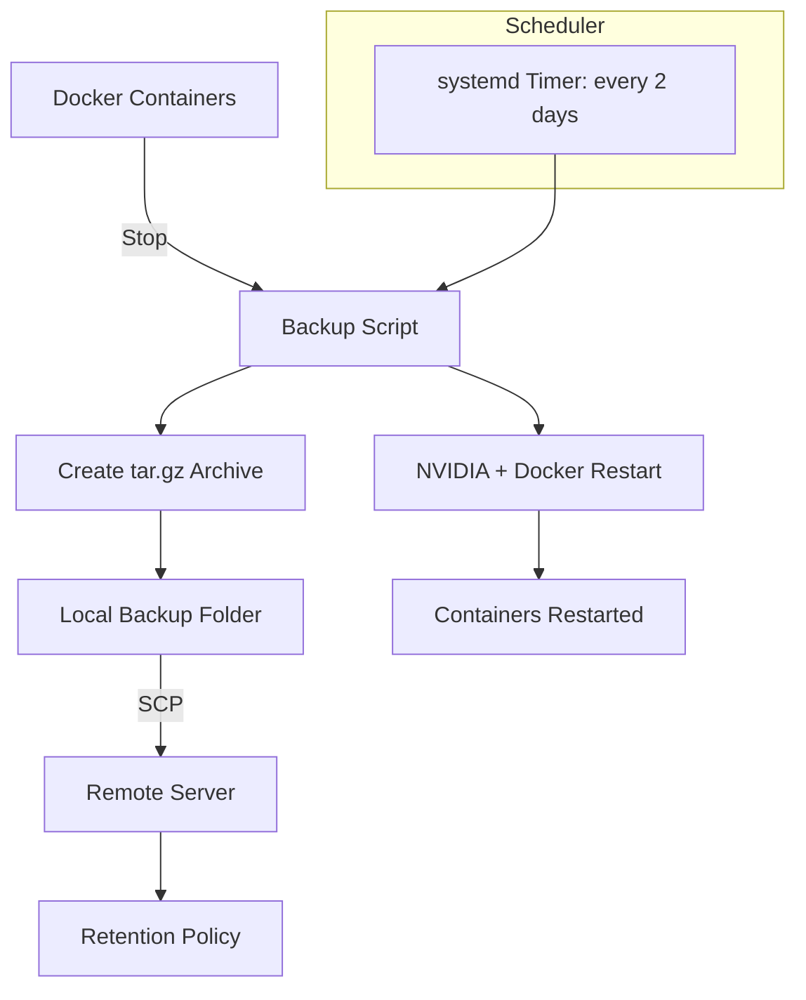

# 🐳 Docker Backup Automation  
**Author:** "dev-project"
**Purpose:** Automatically back up Docker containers (excluding `tdarr`), restart NVIDIA/Docker safely, and transfer archives to a remote server — runs every **2 days**.

---

## 📘 Overview

This setup automates:
1. 🔧 Stopping all containers (except `tdarr`)
2. 📦 Creating a compressed backup archive
3. 🎮 Restarting NVIDIA + Docker services
4. 🚀 Restarting all containers
5. 🌐 Copying the backup to a remote host
6. ♻️ Retaining only the **last 3 local backups**
7. 🕒 Running automatically every **2 days**

---

## 🧭 Architecture Diagram



---

## ⚙️ Prerequisites

| Requirement | Description |
|--------------|-------------|
| 🐧 Linux Host | Running systemd and Docker |
| 🧠 User | `dev-project` user with sudo privileges |
| 💾 Paths | `/home/dev-project/docker` for Docker services |
| 🔒 Remote Server | SSH access to `192.168.1.2` as `dev-project` |

---

## 🚀 Step-by-Step Setup

### 1️⃣ Create the Script

```bash
mkdir -p /home/dev-project/scripts
nano /home/dev-project/scripts/docker-backup.sh
```

Paste the full script content as described earlier, then make it executable:

```bash
chmod +x /home/dev-project/scripts/docker-backup.sh
```

---

### 2️⃣ Configure Sudo Access

Open the sudoers editor:

```bash
sudo visudo
```

Add this line at the bottom:

```
dev-project ALL=(ALL) NOPASSWD: /usr/bin/systemctl stop docker, /usr/bin/systemctl start docker, /usr/bin/systemctl stop nvidia-persistenced, /usr/bin/systemctl start nvidia-persistenced, /usr/sbin/modprobe, /usr/sbin/rmmod
```

---

### 3️⃣ Create the Systemd Service

```bash
sudo nano /etc/systemd/system/docker-backup.service
```

Paste this:

```ini
[Unit]
Description=Docker Backup Service
Wants=network-online.target
After=network-online.target

[Service]
Type=oneshot
User=dev-project
ExecStart=/home/dev-project/scripts/docker-backup.sh
```

---

### 4️⃣ Create the Timer (Every 2 Days)

```bash
sudo nano /etc/systemd/system/docker-backup.timer
```

Paste this:

```ini
[Unit]
Description=Run Docker Backup every 2 days

[Timer]
OnBootSec=5min
OnUnitActiveSec=2d
Persistent=true

[Install]
WantedBy=timers.target
```

Then enable and start the timer:

```bash
sudo systemctl daemon-reload
sudo systemctl enable --now docker-backup.timer
```

Verify with:

```bash
systemctl list-timers | grep docker-backup
```

---

### 5️⃣ Check Logs and Manual Run

To check logs:
```bash
cat /var/log/docker_backup.log
```

To run manually:
```bash
sudo systemctl start docker-backup.service
```

---

### ✅ Result

Your system now automatically:
- Stops containers safely (excluding `tdarr`)
- Creates timestamped backups
- Restarts Docker/NVIDIA safely
- Restarts all containers
- Transfers the archive remotely
- Rotates local backups
- Runs every 2 days automatically

---

### 🧹 Optional (Remote Cleanup)

To remove old backups remotely, add this to the end of your script:

```bash
ssh "$REMOTE_USER@$REMOTE_HOST" "cd $REMOTE_PATH && ls -tp docker-servarr-*.tar.gz | grep -v '/$' | tail -n +4 | xargs -r rm --"
echo "✅ Remote backup rotation completed."
```
