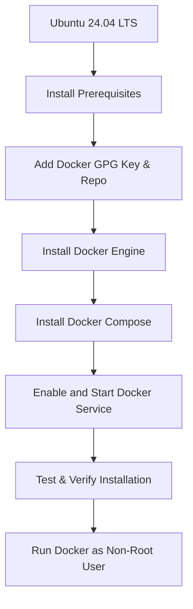
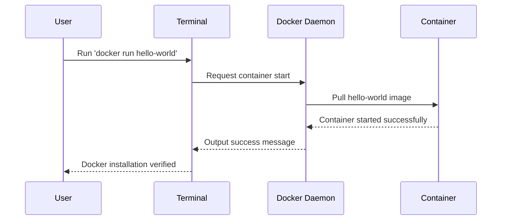

# 🐋 Docker Installation Guide — Ubuntu 24.04 LTS  

**Author:** Bobby  
**Purpose:** Step-by-step guide to install and configure Docker Engine and Docker Compose on Ubuntu 24.04 LTS.

---

## 📘 Overview

This guide will walk you through:  
1. 🔧 Installing prerequisites  
2. 🐳 Setting up Docker’s official repository  
3. 📦 Installing Docker Engine and CLI  
4. 🧩 Installing Docker Compose plugin  
5. 🧠 Verifying and enabling Docker  
6. 👤 Configuring non-root Docker usage  

---

## 🧭 Architecture Diagram



---

## ⚙️ Prerequisites

| Requirement | Description |
|--------------|-------------|
| 🐧 OS | Ubuntu 24.04 LTS |
| 🌐 Internet | Required to download Docker packages |
| 🔑 Sudo Access | User with sudo privileges |

---

## 🚀 Step-by-Step Installation

### 1️⃣ Update System Packages

```bash
sudo apt update && sudo apt upgrade -y
```

---

### 2️⃣ Install Required Packages

```bash
sudo apt install -y ca-certificates curl gnupg lsb-release
```

---

### 3️⃣ Add Docker’s Official GPG Key

```bash
sudo install -m 0755 -d /etc/apt/keyrings
curl -fsSL https://download.docker.com/linux/ubuntu/gpg | sudo gpg --dearmor -o /etc/apt/keyrings/docker.gpg
sudo chmod a+r /etc/apt/keyrings/docker.gpg
```

---

### 4️⃣ Add Docker Repository

```bash
echo   "deb [arch=$(dpkg --print-architecture) signed-by=/etc/apt/keyrings/docker.gpg]   https://download.docker.com/linux/ubuntu $(lsb_release -cs) stable" |   sudo tee /etc/apt/sources.list.d/docker.list > /dev/null
```

Then update package lists:
```bash
sudo apt update
```

---

### 5️⃣ Install Docker Engine, CLI, and Plugins

```bash
sudo apt install -y docker-ce docker-ce-cli containerd.io docker-buildx-plugin docker-compose-plugin
```

---

### 6️⃣ Enable and Start Docker Service

```bash
sudo systemctl enable docker
sudo systemctl start docker
```

To confirm Docker is active:
```bash
sudo systemctl status docker
```

---

### 7️⃣ Verify Installation

Run a test container:
```bash
sudo docker run hello-world
```

You should see a message confirming Docker works correctly.

---

### 8️⃣ Allow Non-Root Docker Usage (Optional but Recommended)

Add your user to the Docker group:
```bash
sudo usermod -aG docker $USER
```

Then **log out and back in**, or run:
```bash
newgrp docker
```

Now test:
```bash
docker run hello-world
```
✅ It should run **without** using `sudo`.

---

### 9️⃣ Verify Docker Compose

Check version:
```bash
docker compose version
```

---

## 🧰 Useful Docker Commands

| Command | Description |
|----------|-------------|
| `docker ps` | List running containers |
| `docker images` | List downloaded images |
| `docker stop <id>` | Stop a container |
| `docker rm <id>` | Remove a container |
| `docker rmi <image>` | Remove an image |
| `docker system prune -a` | Clean up unused images and containers |
| `docker compose up -d` | Start all containers in background |
| `docker compose down` | Stop all containers |

---

## 🧾 Verification Diagram



---

## ✅ Summary

You now have:  
- Docker Engine and CLI installed  
- Docker Compose plugin ready  
- Systemd service enabled  
- Non-root Docker access configured  

Your Ubuntu 24.04 LTS system is fully Docker-ready! 🚀
