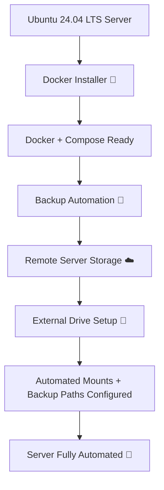

# ⚙️ Ubuntu Server Automation Suite  

Welcome to **Bobby’s Ubuntu Server Automation Suite** —  
a clean, modular toolkit that transforms a plain Ubuntu server into a **ready-to-deploy, auto-managed system**! 🚀  

---

## 🧭 Purpose

This project aims to **automate and simplify** the essential setup tasks for Ubuntu 24.04 LTS servers, including:  
- 🐋 Installing and configuring **Docker & Docker Compose**  
- 💾 Backing up **Docker folders** automatically  
- 🔗 Setting up and mounting **external storage** (for persistent backups or media storage)

Each component works independently — or together — forming a complete, self-maintaining server environment.  

---

## 🧩 Components Overview

| Component | Description | Status |
|------------|--------------|---------|
| 🐳 **Docker Installer** | Installs Docker Engine, CLI, and Compose on Ubuntu 24.04 | ✅ Ready |
| 🧠 **Docker Backup Script** | Automates stopping containers, creating backups, and transferring them remotely | ✅ Ready |
| 💾 **External Storage Automation** | Detects, mounts, and configures external drives for backup or media use | ⚙️ Coming Soon |

---

## 🌈 Visual Workflow



---

## 🧰 Why This Suite?

- 🔒 **Consistency:** Every script is safe to rerun — idempotent and reversible  
- 🧑‍💻 **Simplicity:** One-command setup, clean logging, and minimal dependencies  
- 🧩 **Modularity:** Use only what you need (Docker install, backup, or storage)  
- ⚙️ **Automation:** Turn manual admin chores into predictable, scheduled tasks  
- 📦 **Scalability:** Ideal for home labs, media servers, or development stacks  

---

## 🪄 Quick Start

### 1️⃣ Install Docker and Docker Compose
```bash
chmod +x install-docker.sh
./install-docker.sh
```

### 2️⃣ Set Up Automated Backups
```bash
chmod +x docker-backup.sh
sudo systemctl enable --now docker-backup.timer
```

### 3️⃣ (Coming Soon) Integrate External Storage
```bash
chmod +x setup-external-storage.sh
./setup-external-storage.sh
```
This will automatically detect your external drive, mount it, and configure it as your backup destination.

---

## 🧾 Upcoming Additions

| Planned Feature | Description |
|------------------|-------------|
| 🧮 Storage Health Monitor | Tracks disk space and notifies via email or Telegram |
| ☁️ Remote Sync | Syncs backups to a secondary remote or cloud destination |
| 🛡️ Incremental Backup | Optional rsync mode for differential backups |

---

## 👨‍💻 Author

**Bobby** — *Automation Architect & Server Enthusiast* ⚙️  
> “If you repeat it more than twice, script it once.” 💡  

---

## 📜 License

This project is open-source and free to use. Attribution appreciated. 🙌  
Feel free to modify and extend these scripts for your own automation stack.

---
