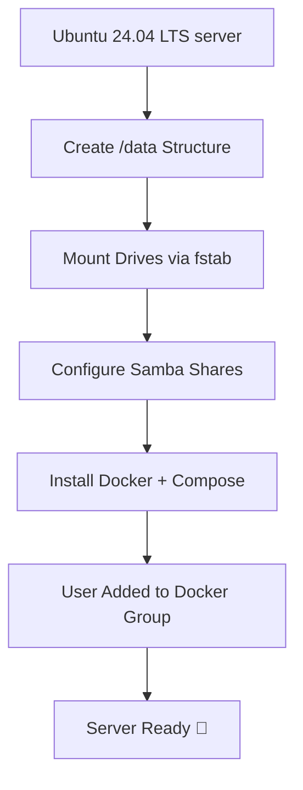

# 🎬 Media Server Setup Automation (Ubuntu 24.04LTS)

Welcome to **dev-project Media-Server Setup Script** — a fully automated way to prepare a Debian-based home or lab server for multimedia management, network sharing, and Dockerized services. 🧩  

This script creates a full storage structure, mounts drives permanently, configures Samba shares for network access, and installs Docker + Docker Compose for containerized apps.

---

## 🧭 Purpose

Automate the initial setup of a **media or backup server** by:
- Creating a consistent `/data` folder hierarchy
- Mounting external or internal drives automatically at boot (`/etc/fstab`)
- Setting up Samba shares for your LAN devices
- Installing Docker and Docker Compose for services like Plex, Radarr, Sonarr, etc.
- Adding your user to the Docker group for password-free container management

---

## ⚙️ Features

| Category | Description |
|-----------|-------------|
| 📂 **Folder Structure** | Creates organized directories for movies, TV shows, torrents, and usenet downloads |
| 💾 **Persistent Mounts** | Configures `/etc/fstab` with UUID-based entries so drives always mount correctly |
| 🔐 **Samba Integration** | Installs and configures Samba + credentials file for secure network sharing |
| 🐳 **Docker Environment** | Installs Docker Engine, Buildx, Compose plugin, and sets user permissions |
| 🔄 **Idempotent Setup** | Safe to re-run — won’t duplicate fstab or Samba entries |
| ⚡ **One-Command Deployment** | From blank Debian install → functional media server in minutes |

---

## 🌈 Visual Overview



---

## 🪄 Folder Layout

```
/data
├── cloud/
├── media/
│   ├── movies/
│   │   ├── Movies1/
│   │   ├── Movies2/
│   │   └── Movies3/
│   └── tv/
│       ├── TvShows1/
│       ├── TvShows2/
│       ├── TvShows3/
│       └── TvShows4/
├── torrents/
│   ├── movies/
│   ├── tv/
│   ├── music/
│   └── books/
└── usenet/
    ├── complete/
    └── incomplete/
```

---

## 🚀 How to Use

1. **Download the script**
   ```bash
   wget https://github.com/YOUR_REPO/setup-media-server.sh
   chmod +x setup-media-server.sh
   ```

2. **Run it**
   ```bash
   ./setup-media-server.sh
   ```

3. Follow on-screen prompts:
   - Enter Samba username & password  
   - Confirm reboot when prompted  

4. **After reboot**, verify:
   ```bash
   df -h | grep /data
   docker version
   ```

---

## 🧠 Important Notes

- Update the UUIDs in `/etc/fstab` to match your own drives (`sudo blkid` helps find them).  
- Use `read -s` inside the script to hide Samba passwords (already implemented in the latest version).  
- You can re-run this script safely; it won’t duplicate entries or reformat drives.  
- For a fully non-interactive install, you can later add a `--non-interactive` flag.

---

## 🧩 Planned Extensions

| Feature | Description | Status |
|----------|-------------|---------|
| ☁️ Cloud Mounts | Auto-mount remote storage (rclone, CIFS, NFS) | 🔧 Planned |
| 💽 External Drive Auto-Detection | Detect & mount USB or SATA drives automatically | 🔧 In Development |
| 🧠 Health Monitoring | Track drive SMART data and usage with notifications | 💡 Planned |

---

## 👨‍💻 Author

**dev-project** — *Server automation enthusiast & media-stack tinkerer* ⚙️  
> “Build once, reuse forever. Let the scripts do the work.”  

---

## 📜 License

Open-source and free to use. Attribution appreciated. 🙌
